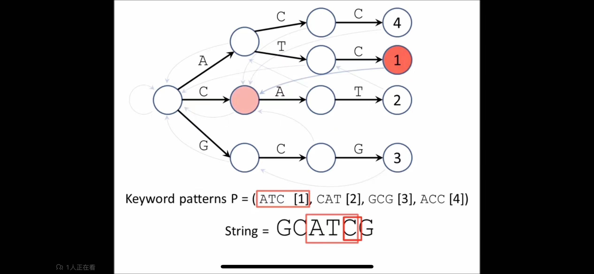

# 模式串匹配算法

## 1.BF暴力匹配算法  

BF和RK算法的思路，都是模式串和主串，逐个位置向后滑动匹配。
时间复杂度为 **O(n\*m)**

## 2.RK算法

RK 在BF算法基础上，通过对比哈希值进行了优化，时间复杂度可以达到 **O(n)**，关键在于哈希算法是否存在冲突 冲突严重情况下会退化为 O(n*m)
另外能够适配所有字符的哈希算法也并不简单

## 3.BM算法 

BM算法的思路是，每次不匹配后，尽量多的向后滑动，提高整体匹配的效率。
最好情况下，时间复杂度是 **O(n/m)**  即每次向后滑动的距离都是 模式串的长度

核心有两个原则：**坏字符原则 好后缀原则**

### 坏字符原则
模式串和主串匹配时，从后往前进行逐个字符匹配，在主串中遇到的第一个不匹配的字符，就是 坏字符。在模式串中继续向前搜索，如果也存在
坏字符一样的字符，则滑动到坏字符的位置；如果不存在 则滑动到坏字符后面的位置。

### 好后缀原则
模式串和主串匹配的公共后缀子串，为好后缀。
在模式串中，寻找和好后缀相等的 前缀子串，如果存在，滑动至前缀子串的位置，继续寻找；
如果不存在，不能直接滑动到模式串的开始位置，因为好后缀 可能会和 模式串的前缀 部分重合，为了避免滑动的过头，需要滑动到重合的部分。
如果不存在 和好后缀相等的 前缀子串，和不存在 和好后缀有重合部分的 前缀子串，那么直接 滑动至模式串的开始位置。

关键是计算 suffix数组和prefix数组

cabcab

    b  suffix[1]=2
   ab  suffix[2]=1 
  cab  suffix[3]=0  prefix[3]=true
 bcab  suffix[4]=-1
abcab  suffix[5]=-1

王争老师专栏里的计算方案，是逐个取主串的前缀子串，c ca cab ... 和后缀子串进行比较，计算出suffix和prefix数组。这里刚开始有个比较疑惑的点，suffix数组靠前的
数据，会重复计算，后面计算的值会覆盖前面计算过的值。即真正的有效值是 最接近字符串末尾的。如 模式串是 cabcabcab  ，计算子串cab的时候会赋值，
suffix[1]=2  suffix[2]=1 suffix[3]=0 prefix[3]=true  然后计算子串 cabcab时，会覆盖之前的值 suffix[1]=5 suffix[2]=4 suffix[3]=3 prefix[3]=false
因为对于 好后缀cab来说，第二个cab才是他应该匹配的子串

其实，这里计算suffix的过程，可以类比KMP算法中next数组的推导过程，也有迭代的思想。suffix[i] 和 suffix[i-1] 也是有推导关系的

suffix[i] = if(suffix[i]代表的子串 比 suffix[i-1]代表的子串 多出来的前面哪个字符 == suffix[i-1]值对应坐标的字符, suffix[i-1] - 1 ,-1)

如 b 对应 suffix[1]=2，ab多出来的 a字符 等于下标为1(suffix[1]-1)的字符a ，所以suffix[2] = suffix[2] - 1 = 1
这个例子也可以观察到，suffix数组的连续性 suffix[1]=2 suffix[2]=1 suffix[3]=0

### 坏字符 vs 好后缀
在匹配过程中如何选择 坏字符原则 还是 好后缀原则呢？
答案是 分别计算坏字符原则和好后缀原则 移动的距离，选择移动距离大的，这样匹配的效率高。

这里有一个疑问，每次都用两个原则进行计算移动距离，也会影响匹配的效率的，这个问题怎么解决？

## 4.KMP算法
好前缀原则，类似于BM算法中的好后缀原则，只不过KMP算法是从前往后滑动匹配，遇到坏字符停下来，前面部分匹配的子串即为好前缀。
接下来，继续向后滑动的时候要考虑，滑动的距离。那就需要计算 这个好前缀的 "最长匹配前后缀子串"

关键是计算 next数组
next[k]数组的定义，k+1长度的前缀子串(即最大数组下标是k)，它能够匹配的前后子串的结束下标(也相当于长度 下标+1即是长度)

a        next[0]=-1
ab       next[1]=-1
aba      next[2]=0
abab     next[3]=1
ababa    next[4]=2
ababac   next[5]=-1
ababaca  next[6]=0
ababacab next[7]=1

计算的逻辑，next[i]可以通过next[i-1]进行计算获得，有迭代的思想

next[i] = if(next[i-1]的下一个字符 == next[i]的最后一个字符 即第i个字符, next[i-1] + 1, -1)

**_以上均是单模式串匹配算法，Trie树和AC自动机是多模式串匹配算法_**

## 5.Trie树

适用于前缀匹配的场景，如搜索框自动提示词、输入法联想。

## 6.AC自动机

在Trie树的基础上，每个节点构建失败指针，指向它的最长匹配后缀串。
在某个字符串匹配失败后，通过失败指针回退，并继续匹配。

 

Tips：字符串处理过程中，经常会使用辅助空间(数组或map)来提升算法的效率

最长回文子串